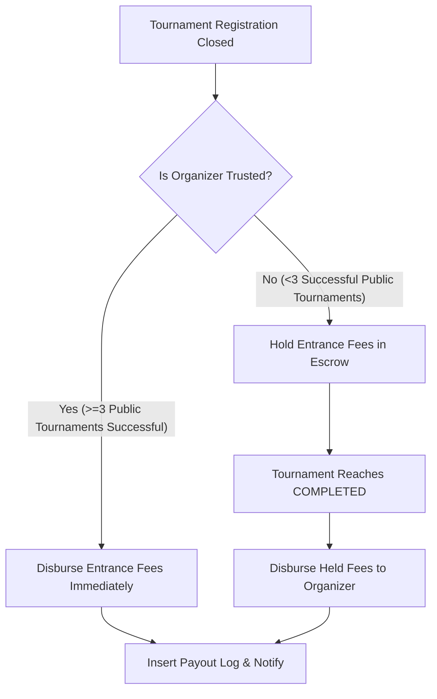

# 🛠️ Kế hoạch Tái cấu trúc Hệ thống Admin & Logic Nghiệp vụ Tài chính - Uy tín

Tài liệu này vạch ra thiết kế kiến trúc toàn diện và kế hoạch triển khai cho hệ thống Admin Dashboard cao cấp, kết hợp cải tiến các quy tắc kinh doanh (Business Rules) liên quan đến Cộng đồng (Communities), Uy tín Người tổ chức (Organizer Reputation) và Dòng tiền/Lệ phí (Payments/Payouts).

---

## 1. Mục tiêu & Định hướng Thiết kế
Tuân thủ nghiêm ngặt **Skills Map (skills.md)**:
* **Không Code trực tiếp:** Chỉ phân tích, nghiên cứu chi tiết và lên kế hoạch kỹ thuật cho các lập trình viên khác triển khai.
* **Premium Dashboard UI:** Định hình giao diện Admin tối tân sử dụng bảng màu HSL tuyển chọn (Deep Indigo, Slate, Emerald), hiệu ứng kính mờ (Glassmorphism), biểu đồ trực quan động và vi chỉnh chuyển động (Micro-animations).
* **Kiểm soát Dòng tiền:** Đảm bảo tính ACID tuyệt đối cho mọi giao dịch tài chính, cơ chế đối soát tự động (Idempotency) và lưu vết vết hoạt động (Audit Trail).

---

## 2. Thay đổi Cơ sở Dữ liệu (Database Schema Changes)

### 2.1 Bảng `communities` (Cộng đồng)
* **Loại bỏ phê duyệt:** Chuyển đổi giá trị mặc định của cột `status` từ `'PENDING'` sang `'ACTIVE'`.
* **Ràng buộc số lượng:** Thêm chỉ mục và ràng buộc kiểm soát mức ứng dụng (hoặc Trigger mức DB) để giới hạn tối đa 5 cộng đồng đang hoạt động cho một tài khoản.

```sql
-- Thay đổi giá trị mặc định của status cộng đồng
ALTER TABLE communities ALTER COLUMN status SET DEFAULT 'ACTIVE';

-- Tạo Index để tối ưu truy vấn đếm số lượng cộng đồng của Creator
CREATE INDEX idx_communities_creator_active ON communities(creator_id) WHERE deleted_at IS NULL;
```

### 2.2 Hệ thống Uy tín Người tổ chức (Organizer Reputation)
Quy tắc đơn giản: Người tổ chức đạt **Uy tín (Trusted)** khi đã tổ chức thành công **ít nhất 3 giải đấu công khai** (`visibility = 'PUBLIC'` và `status = 'COMPLETED'`).

* **Không cần View thời gian thực hay cơ chế phức tạp.** Chỉ cần 1 câu truy vấn COUNT đơn giản chạy tại thời điểm cần kiểm tra (khi chốt danh sách giải đấu):

```sql
-- Kiểm tra uy tín: Đếm số giải PUBLIC đã COMPLETED của người tổ chức
SELECT COUNT(*) AS successful_count
FROM tournaments
WHERE created_by = :userId
  AND visibility = 'PUBLIC'
  AND status = 'COMPLETED'
  AND deleted_at IS NULL;

-- Nếu successful_count >= 3 → Người tổ chức đạt Uy tín (Trusted)
-- Nếu successful_count < 3  → Chưa Uy tín, sàn giữ lệ phí
```

* **Thời điểm kiểm tra:** Chỉ chạy query này **1 lần duy nhất** khi giải đấu chốt danh sách đăng ký (Registration End Date), không cần theo dõi liên tục.

### 2.3 Bảng `payments` & `organizer_payouts` (Dòng tiền & Giải ngân)
Bổ sung cơ chế khóa giữ lệ phí (Escrow/Hold) và tự động/thủ công giải ngân:

```sql
-- Bổ sung trường quản lý thời hạn giữ tiền
ALTER TABLE organizer_payouts ADD COLUMN hold_until TIMESTAMP WITH TIME ZONE;
ALTER TABLE organizer_payouts ADD COLUMN payout_trigger VARCHAR(50) DEFAULT 'MANUAL'; -- 'AUTO_ON_LOCK', 'MANUAL_ON_COMPLETE'
ALTER TABLE organizer_payouts ADD COLUMN disbursed_at TIMESTAMP WITH TIME ZONE;
```

---

## 3. Kiến trúc Logic Nghiệp vụ (Backend Service Logic)



### 3.1 Quy tắc Giới hạn 5 Cộng đồng
* **Layer:** `CommunitiesService.create()`
* **Logic:**
  1. Thực hiện truy vấn đếm số cộng đồng hiện tại của user:
     `SELECT COUNT(*) FROM communities WHERE creator_id = :userId AND deleted_at IS NULL`
  2. Nếu kết quả `>= 5`, lập tức ném ra lỗi `BadRequestException` với thông điệp: `"Mỗi người dùng chỉ được phép tạo tối đa 5 cộng đồng."`
  3. Bỏ qua bước kiểm tra quyền admin phê duyệt (`approved_by`, `reviewed_at` để trống, `status` lưu thẳng là `'ACTIVE'`).

### 3.2 Quy tắc Tích Uy tín & Giải ngân Lệ phí Giải đấu
* **Layer:** `PaymentsService` / `PayoutsService`
* **Quy trình Xử lý Tài chính:**
  1. **Khi Giải đấu Chốt Danh sách (Registration End Date):**
     * Trạng thái đăng ký chuyển sang khóa sổ. Hệ thống tính tổng số tiền lệ phí thu được thực tế (`total_collected`).
     * Thực hiện kiểm tra uy tín của người tổ chức (`created_by` của giải đấu):
       * **Trường hợp Uy tín (Trusted):**
         * Tạo bản ghi giải ngân `organizer_payouts` với trạng thái `'PENDING_DISBURSEMENT'`.
         * Chuyển tiền thẳng về ví/tài khoản ngân hàng của BTC ngay lập tức (phí nền tảng `platform_fee_retained` tự động khấu trừ giữ lại).
       * **Trường hợp Chưa Uy tín:**
         * Tạo bản ghi giải ngân `organizer_payouts` với trạng thái `'HELD_IN_ESCROW'`.
         * Thiết lập ngày mở khóa `hold_until` trùng với dự kiến kết thúc giải đấu (`end_date` của giải).
         * Lệ phí đóng từ người dùng sẽ được sàn giữ lại làm tài sản đảm bảo phòng trường hợp giải bị hủy hoặc xảy ra tranh chấp.
  2. **Khi Giải đấu Kết thúc thành công (`status = 'COMPLETED'`):**
     * Kiểm tra xem giải đấu có khiếu nại (Dispute) chưa giải quyết hay không.
     * Nếu không có khiếu nại, tự động chuyển đổi trạng thái bản ghi payout của giải đấu đó từ `'HELD_IN_ESCROW'` sang `'PENDING_DISBURSEMENT'` để thực hiện chuyển tiền.

---

## 4. Tái Thiết kế Giao diện Admin Dashboard (Premium Spec)

Giao diện Admin sẽ được tái cấu trúc thành một Single Page Application (SPA) chuyên nghiệp, tập trung vào trải nghiệm mượt mà, phản trực quan và hiện đại.

### 4.1 Bảng màu & Phong cách thiết kế (HSL Tailored Theme)
* **Nền tảng (Background):** Slate Dark Mode (`#0b0f19`) kết hợp hiệu ứng kính mờ (Glassmorphism) backdrop-blur-md.
* **Màu chủ đạo (Primary):** Deep Indigo (`hsl(234, 89%, 74%)`) mang lại cảm giác công nghệ cao.
* **Màu điểm nhấn tài chính (Accent):** Emerald (`hsl(142, 72%, 29%)`) hiển thị các số liệu doanh thu tăng trưởng.
* **Hiệu ứng chuyển động:** Sử dụng `framer-motion` cho các hành động Hover, Transition giữa các Tab, và biểu diễn Biểu đồ.

### 4.2 Cấu trúc các Trang Admin mới

#### 1. Tổng quan Doanh thu & Dòng tiền (Revenue Dashboard)
* **Khu vực 1 - Chỉ số chính (Top Metrics Grid):**
  * **Tổng Giá trị Giao dịch (GMV):** Số tiền đang luân chuyển trên sàn.
  * **Doanh thu Thực tế (Net Revenue):** Số tiền thu được từ phí nền tảng 5%.
  * **Tiền Đang Giữ Hộ (Held Escrow):** Tổng tiền lệ phí của các BTC chưa uy tín.
  * **Số lượng Giao dịch (Transactions Count):** Đi kèm biểu đồ sparkline nhỏ bên dưới.
* **Khu vực 2 - Biểu đồ Doanh thu (Revenue Chart):**
  * Biểu đồ Area Chart mượt mà (smooth curve) cho phép chuyển đổi chế độ xem: **Tuần**, **Tháng**, **Năm**.
  * Dòng doanh thu nền tảng hiển thị dưới màu xanh Emerald sang trọng, có tooltip hiển thị chi tiết khi rê chuột.
* **Khu vực 3 - Danh sách Giải ngân gần đây (Recent Payouts):**
  * Bảng hiển thị thông tin giải đấu, tên BTC, tài khoản ngân hàng, số tiền, và Badge trạng thái giải ngân:
    * `[Auto-disbursed]` (Màu xanh dương - chuyển ngay cho người uy tín)
    * `[Held in Escrow]` (Màu vàng cam - đang tạm giữ)
    * `[Completed & Released]` (Màu xanh lá - đã trả sau khi kết thúc giải)

#### 2. Nhật ký Hệ thống (System Audit Logs)
* Thiết kế dạng Terminal view cao cấp:
  * Cho phép tìm kiếm toàn văn và lọc nhanh theo: **Người dùng (User)**, **Cộng đồng (Community)**, **Hành động (Action)** (ví dụ: `UPDATE`, `CREATE`, `PAYOUT`).
  * **JSON Diff Viewer:** Khi nhấn vào một dòng log, giao diện sẽ bung ra so sánh trực quan hai phiên bản dữ liệu `old_values` và `new_values` (dòng đỏ hiển thị phần bị xóa, dòng xanh lá hiển thị phần được thêm mới).

#### 3. Quản lý Cộng đồng & Uy tín (Community & Reputation Manager)
* **Quản lý Cộng đồng:**
  * Bảng hiển thị danh sách cộng đồng (tự động kích hoạt khi tạo).
  * Hiển thị chỉ số số lượng cộng đồng hiện tại của người dùng (ví dụ: `2/5` hoặc `5/5 - Đạt giới hạn`).
  * Nút tạm khóa (Deactivate) cộng đồng vi phạm.
* **Quản lý Uy tín Người dùng (User Reputation):**
  * Danh sách toàn bộ Organizer đi kèm tích xanh uy tín `[👑 Uy Tín]` hoặc `[🔰 Mới Tạo]`.
  * Hiển thị số lượng giải đấu đã tổ chức thành công.
  * Cho phép Admin gán nhãn uy tín thủ công hoặc gỡ bỏ uy tín nếu phát hiện vi phạm quy chế.

---

## 5. Kế hoạch Triển khai (Checklist Cho Lập Trình Viên)

### Phase 1: Database & Backend Logic
- [ ] Thiết lập migration để thay đổi giá trị mặc định của `communities.status` thành `'ACTIVE'`.
- [ ] Viết API Check trước khi tạo cộng đồng (giới hạn tối đa 5 cộng đồng/user).
- [ ] Triển khai hàm tính toán uy tín tự động của người dùng dựa trên số lượng giải đấu `PUBLIC` thành công.
- [ ] Sửa đổi logic luồng thanh toán: Khi đóng cổng đăng ký, thực hiện kiểm tra uy tín và tạo bản ghi Payout tương ứng (Giải ngân ngay hay tạm giữ).
- [ ] Viết cron job hoặc listener để tự động giải phóng khoản tiền giữ hộ khi giải đấu cập nhật trạng thái thành `'COMPLETED'`.

### Phase 2: API Phục vụ Dashboard Admin
- [ ] Phát triển API `/admin/dashboard/metrics` trả về các chỉ số GMV, Doanh thu, Tiền tạm giữ.
- [ ] Phát triển API `/admin/dashboard/revenue-chart` hỗ trợ lọc theo group theo ngày/tuần/tháng/năm.
- [ ] Phát triển API `/admin/audit-logs` hỗ trợ phân trang, lọc nâng cao và hiển thị diff.

### Phase 3: Phát triển Giao diện Admin (Next.js & Tailwind)
- [ ] Dựng khung UI Admin theo thiết kế Glassmorphism tối sang trọng.
- [ ] Tích hợp thư viện biểu đồ Recharts vẽ biểu đồ doanh thu động.
- [ ] Xây dựng bảng đối soát tài chính, hiển thị trạng thái giải ngân lệ phí của từng giải đấu.
- [ ] Dựng giao diện xem Audit Logs kèm JSON Diff.
- [ ] Hoàn thiện các trang quản lý người dùng, cộng đồng và các badge uy tín.
