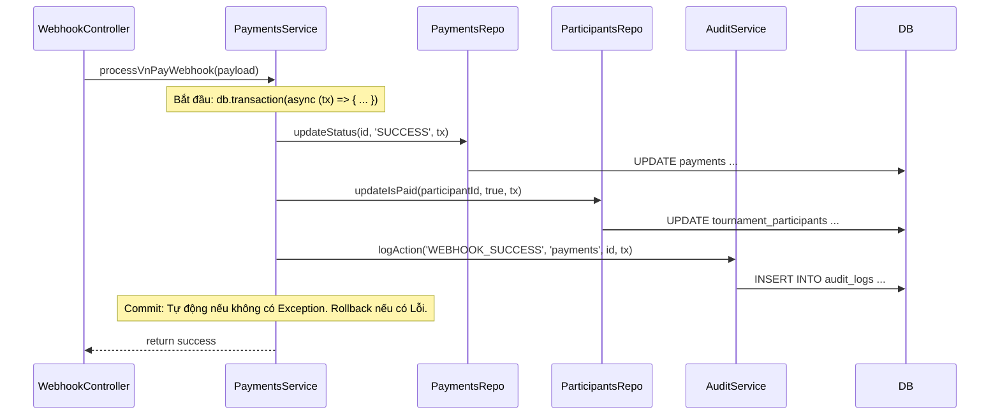
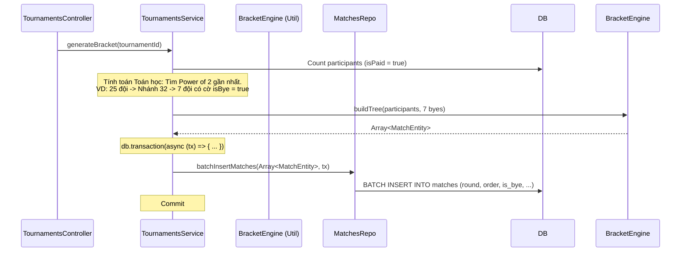
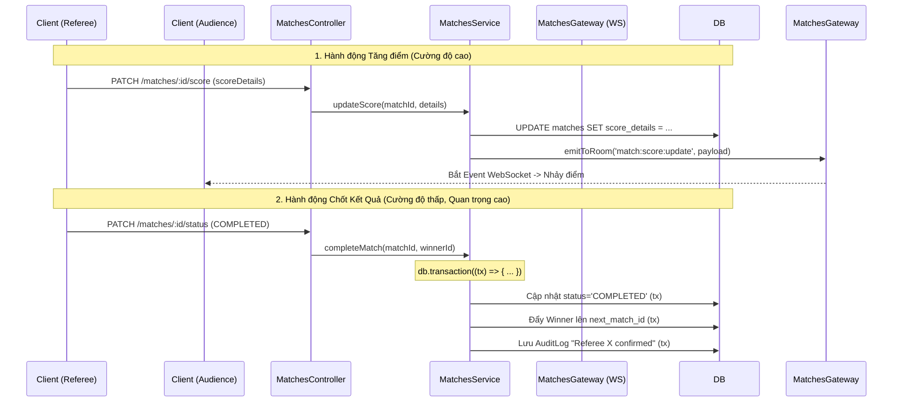
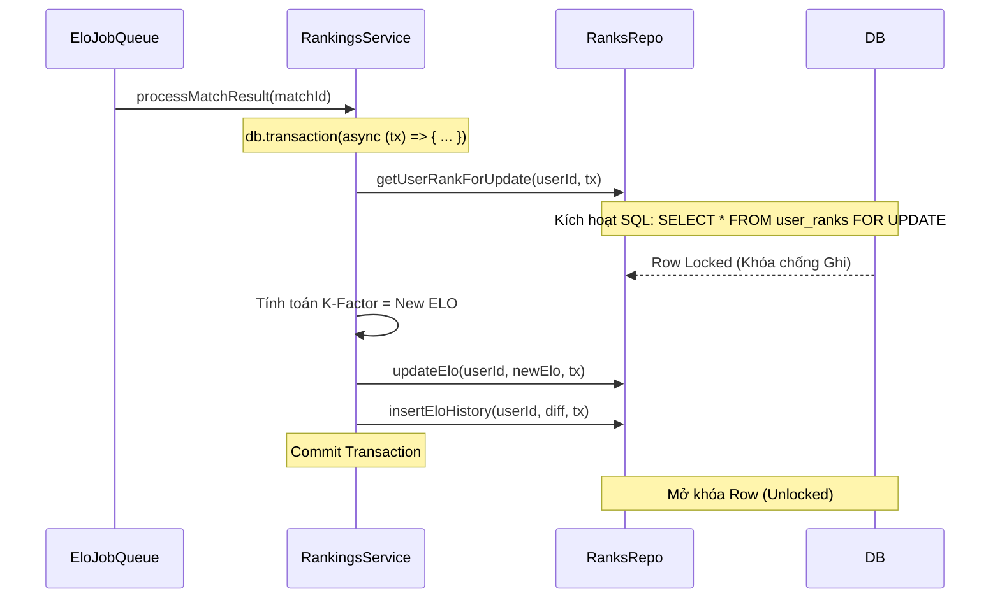

# Kiến trúc Luồng Xử Lý Nội Bộ (Internal Architecture Flows)

Khác với các sơ đồ High-level chỉ vẽ mũi tên qua lại, tài liệu này đi sâu vào **Kiến trúc Mã nguồn Nội bộ (Internal Code Architecture)**. Mọi Developer khi code các Module này bắt buộc phải tuân thủ luồng truyền `transaction (tx)` và cách sắp xếp layer `Controller -> Service -> Repository`.

---

## 1. Luồng Thanh toán VNPay (Webhook Flow)
Luồng này đòi hỏi tính ACID nghiêm ngặt (Skill 2). Nếu Cập nhật Payment thành công nhưng bị lỗi lúc Ghi AuditLog thì MỌI THỨ PHẢI ĐƯỢC ROLLBACK.

---

## 2. Luồng Sinh Nhánh Đấu (Bracket Generation)
Chỉ Admin giải được gọi. Logic chia hạt giống và đội đặc cách (isBye) nằm ở Service.

---

## 3. Luồng Live Score (WebSocket + HTTP)
Sử dụng kết hợp Gateways (Socket) để phát Real-time, nhưng vẫn dùng HTTP để đảm bảo an toàn thao tác.

---

## 4. Luồng Tính ELO (Pessimistic Locking)
Luồng này chạy nền (Async Job/Cron) sau khi trận đấu kết thúc. Sử dụng Khóa Dữ Liệu `FOR UPDATE` để ngăn chặn lỗi đồng bộ nếu 1 User kết thúc 2 trận đấu sát giờ nhau.

