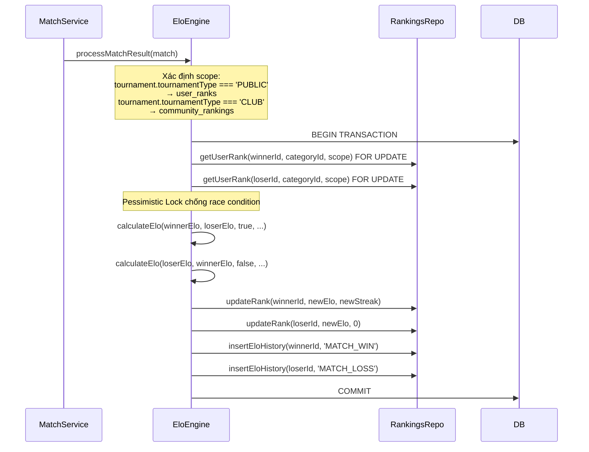

# 📋 Kế Hoạch Phase 5 — Backend API Nâng Cấp Toàn Diện

> Tài liệu này mô tả **từng bước cụ thể** để triển khai Phase 5 backend.
> AI Agent: Đọc file này + `skills.md` + `database_schema.md` trước khi viết code.
> **KHÔNG ĐƯỢC viết code cho đến khi đọc hiểu hết tài liệu này.**

---

## Tổng Quan Các Module Phase 5

| # | Module | Priority | Dependencies |
|---|--------|----------|--------------|
| 1 | Schema Migration | 🔴 Bắt buộc đầu tiên | Không |
| 2 | Tournament Visibility & Invite Link | 🔴 High | Module 1 |
| 3 | Tournament Registration (Singles + Doubles) | 🔴 High | Module 1, 2 |
| 4 | Community-Scoped Tournaments | 🟡 Medium | Module 1 |
| 5 | Bracket & Set Scoring Nâng Cao | 🟡 Medium | Module 3 |
| 6 | Professional ELO System | 🔴 High | Module 5 |
| 7 | Region-Based Filtering | 🟡 Medium | Không |

---

## Module 1: Schema Migration

### 1.1 Bảng `tournaments` — Thêm cột mới

```sql
-- Chế độ hiển thị giải đấu
ALTER TABLE tournaments ADD COLUMN visibility VARCHAR(50) DEFAULT 'PUBLIC' NOT NULL;
-- 'PUBLIC': Hiển thị trên trang /tournaments, ai cũng tìm thấy
-- 'PRIVATE': Ẩn khỏi tìm kiếm, chỉ truy cập qua invite link (invite_code đã có sẵn)

-- Ràng buộc giới tính tham gia
ALTER TABLE tournaments ADD COLUMN gender_restriction VARCHAR(20);
-- NULL = Không ràng buộc (tự do)
-- 'MALE' = Chỉ nam
-- 'FEMALE' = Chỉ nữ
-- 'MIXED' = Bắt buộc 1 nam + 1 nữ (cho doubles)
```

**Drizzle Schema tương ứng** — File: `src/database/schema/tournaments.schema.ts`
```typescript
visibility: varchar('visibility', { length: 50 }).default('PUBLIC').notNull(),
genderRestriction: varchar('gender_restriction', { length: 20 }),
```

### 1.2 Bảng `tournament_participants` — Thêm cột mới

```sql
-- Token mời partner vào đội (doubles)
ALTER TABLE tournament_participants ADD COLUMN team_invite_token VARCHAR(50) UNIQUE;

-- Trạng thái hoàn thành đội
ALTER TABLE tournament_participants ADD COLUMN team_status VARCHAR(50) DEFAULT 'PENDING' NOT NULL;
-- 'PENDING': Đang chờ đủ thành viên (doubles chưa đủ 2 người)
-- 'COMPLETE': Đủ thành viên
-- 'WITHDRAWN': Đã rút lui
```

**Drizzle Schema tương ứng** — File: `src/database/schema/tournaments.schema.ts`
```typescript
// Thêm vào tournamentParticipants
teamInviteToken: varchar('team_invite_token', { length: 50 }).unique(),
teamStatus: varchar('team_status', { length: 50 }).default('PENDING').notNull(),
```

### 1.3 Bảng `user_ranks` — Thêm cột mới

```sql
-- Chuỗi thắng liên tiếp (dùng để tính bonus ELO)
ALTER TABLE user_ranks ADD COLUMN win_streak INTEGER DEFAULT 0 NOT NULL;
```

**Drizzle Schema** — File: `src/database/schema/categories.schema.ts`
```typescript
// Thêm vào userRanks
winStreak: integer('win_streak').default(0).notNull(),
```

### 1.4 Bảng mới: `community_rankings`

> ELO riêng cho từng CLB. Tách biệt hoàn toàn với ELO public.

```sql
CREATE TABLE community_rankings (
    id UUID PRIMARY KEY DEFAULT uuid_generate_v4(),
    community_id UUID REFERENCES communities(id) ON DELETE CASCADE NOT NULL,
    user_id UUID REFERENCES users(id) ON DELETE CASCADE NOT NULL,
    category_id UUID REFERENCES categories(id) ON DELETE CASCADE NOT NULL,
    elo_points INTEGER DEFAULT 1000 NOT NULL,
    matches_played INTEGER DEFAULT 0 NOT NULL,
    matches_won INTEGER DEFAULT 0 NOT NULL,
    win_streak INTEGER DEFAULT 0 NOT NULL,
    updated_at TIMESTAMP WITH TIME ZONE DEFAULT CURRENT_TIMESTAMP NOT NULL,
    CONSTRAINT community_user_category_unique UNIQUE (community_id, user_id, category_id),
    CONSTRAINT community_elo_non_negative CHECK (elo_points >= 0)
);

CREATE INDEX idx_community_rankings_leaderboard ON community_rankings(community_id, category_id, elo_points DESC);
```

**Drizzle Schema** — File mới: `src/database/schema/community_rankings.schema.ts`
```typescript
export const communityRankings = pgTable('community_rankings', {
  id: uuid('id').primaryKey().defaultRandom(),
  communityId: uuid('community_id').references(() => communities.id, { onDelete: 'cascade' }).notNull(),
  userId: uuid('user_id').references(() => users.id, { onDelete: 'cascade' }).notNull(),
  categoryId: uuid('category_id').references(() => categories.id, { onDelete: 'cascade' }).notNull(),
  eloPoints: integer('elo_points').default(1000).notNull(),
  matchesPlayed: integer('matches_played').default(0).notNull(),
  matchesWon: integer('matches_won').default(0).notNull(),
  winStreak: integer('win_streak').default(0).notNull(),
  updatedAt: timestamp('updated_at', { withTimezone: true }).defaultNow().notNull(),
}, (table) => ({
  communityUserCategoryUnique: unique('community_user_category_unique').on(table.communityId, table.userId, table.categoryId),
  communityEloNonNegative: check('community_elo_non_negative', sql`${table.eloPoints} >= 0`),
}));
```

### 1.5 Quy trình Migration

```bash
# 1. Sửa schema files
# 2. Generate migration
cd backend-api_qlgiaidau
pnpm drizzle-kit generate

# 3. Review SQL file trong src/database/migrations/
# 4. Push lên database
pnpm drizzle-kit push

# 5. Restart backend (BẮT BUỘC — Drizzle cache Prepared Statements)
# Kill process hiện tại rồi chạy lại:
pnpm start:dev
```

---

## Module 2: Tournament Visibility & Invite Link

### 2.1 Nghiệp vụ

- BTC setting giải đấu: **PUBLIC** hoặc **PRIVATE** trong trang quản lý.
- Giải PUBLIC: Hiện trên trang tìm kiếm `/tournaments`, ai cũng đăng ký.
- Giải PRIVATE: Ẩn khỏi tìm kiếm. BTC gửi link mời → User nhấn link → Check đăng nhập → Đăng ký.
- Link mời format: `{FRONTEND_URL}/tournaments/{id}/register?invite={inviteCode}`
- Cột `invite_code` đã có sẵn trong schema (varchar(20) UNIQUE).

### 2.2 DTO Changes

**File: `src/modules/tournaments/dto/create-tournament.dto.ts`**
```typescript
// Thêm fields:
@IsOptional()
@IsEnum(['PUBLIC', 'PRIVATE'])
visibility?: 'PUBLIC' | 'PRIVATE'; // default 'PUBLIC'

@IsOptional()
@IsEnum(['MALE', 'FEMALE', 'MIXED'])
genderRestriction?: 'MALE' | 'FEMALE' | 'MIXED' | null;
```

**File: `src/modules/tournaments/dto/update-tournament.dto.ts`**
```typescript
// Thêm tương tự như create DTO
```

### 2.3 API Changes — Tournaments Controller

#### `GET /tournaments` — Lọc theo visibility
```
Logic trong Repository:
- Nếu KHÔNG có token (public access) HOẶC có query param `visibility=PUBLIC`:
    → WHERE visibility = 'PUBLIC'
- Nếu CÓ token + query `created_by=me`:
    → Hiện tất cả giải của user (cả PUBLIC + PRIVATE)
- Thêm query params: tournamentType, communityId, region
```

#### `GET /tournaments/:id` — Check quyền truy cập giải PRIVATE
```
Logic:
- Nếu giải PUBLIC → trả về bình thường
- Nếu giải PRIVATE:
    - User là owner (createdBy) → OK
    - User truyền query param `invite={code}` và code khớp → OK
    - Ngược lại → 403 Forbidden "Giải đấu này yêu cầu mã mời"
```

#### `POST /tournaments/:id/validate-invite` (ENDPOINT MỚI)
```
Input Body: { inviteCode: string }
Logic:
  1. Tìm tournament có id và inviteCode khớp
  2. Nếu khớp → trả về thông tin giải (tên, ngày, phí, matchType, genderRestriction)
  3. Nếu không khớp → 400 "Mã mời không hợp lệ"
Auth: @Public() — không cần đăng nhập để validate
```

#### `POST /tournaments/:id/regenerate-invite` (ENDPOINT MỚI)
```
Auth: Chỉ owner giải (createdBy)
Logic: Sinh invite_code mới (random 8 ký tự), cập nhật DB
Output: { inviteCode: string }
```

---

## Module 3: Tournament Registration (Singles + Doubles)

### 3.1 Nghiệp vụ chung

Khi user đăng ký tham gia giải:
1. Check user đã đăng nhập (JWT Guard)
2. Check giải đang mở đăng ký (`status === 'REGISTRATION_OPEN'` hoặc `status === 'UPCOMING'`)
3. Check chưa đăng ký trùng (user chưa có trong rosters của giải này)
4. Nếu giải PRIVATE → check invite_code hợp lệ
5. Check giới tính phù hợp ràng buộc (`gender_restriction`)
6. Check chưa đầy (`participants count < max_participants`)

### 3.2 Flow Singles (match_type = 'SINGLES')

```
POST /tournaments/:id/register
Body: { teamName: string, inviteCode?: string }
Auth: JWT Required

Logic:
1. Validate các điều kiện ở 3.1
2. Tạo tournament_participants record:
   - teamName: body.teamName
   - registeredBy: currentUser.id
   - teamStatus: 'COMPLETE' (singles chỉ cần 1 người)
   - isPaid: false (nếu có phí)
3. Tạo tournament_rosters record:
   - participantId: participant.id
   - userId: currentUser.id
   - role: 'MAIN'
4. Nếu entry_fee > 0 → Tạo payment record (PENDING) → Trả về URL thanh toán
5. Nếu entry_fee = 0 → isPaid = true

Response: { participant, paymentUrl? }
```

### 3.3 Flow Doubles (match_type = 'DOUBLES')

#### Bước 1: Team Leader đăng ký

```
POST /tournaments/:id/register
Body: { teamName: string, inviteCode?: string }
Auth: JWT Required

Logic:
1. Validate các điều kiện ở 3.1
2. Tạo tournament_participants record:
   - teamName: body.teamName
   - registeredBy: currentUser.id
   - teamStatus: 'PENDING' (chưa đủ 2 người)
   - teamInviteToken: crypto.randomUUID().slice(0, 12) (token mời partner)
   - isPaid: false
3. Tạo tournament_rosters record cho leader:
   - participantId: participant.id
   - userId: currentUser.id
   - role: 'MAIN'
4. CHƯA tạo payment (phải đủ 2 người mới thanh toán)

Response: {
  participant,
  teamInviteLink: "{FRONTEND_URL}/tournaments/{id}/join-team?pid={participantId}&token={teamInviteToken}"
}
```

#### Bước 2: Partner join team

```
POST /tournaments/:id/join-team
Body: { participantId: string, teamInviteToken: string }
Auth: JWT Required

Logic:
1. Tìm participant có id và teamInviteToken khớp
2. Check participant.teamStatus === 'PENDING' (chưa đủ người)
3. Check user chưa đăng ký giải này (chống trùng)
4. Check giới tính:
   - Nếu genderRestriction === 'MIXED':
     - Lấy giới tính của leader (từ profiles)
     - Lấy giới tính của partner (từ profiles)
     - Nếu cả 2 cùng giới → 400 "Giải Mixed Doubles yêu cầu 1 nam + 1 nữ"
   - Nếu genderRestriction === 'MALE': check partner.gender === 'MALE'
   - Nếu genderRestriction === 'FEMALE': check partner.gender === 'FEMALE'
5. Tạo tournament_rosters record cho partner:
   - participantId: participant.id
   - userId: currentUser.id
   - role: 'MAIN'
6. Cập nhật participant.teamStatus = 'COMPLETE'
7. Nếu entry_fee > 0 → Tạo payment record → Trả về URL thanh toán
8. Nếu entry_fee = 0 → isPaid = true

Response: { participant, paymentUrl? }
```

#### Rút lui

```
POST /tournaments/:id/withdraw
Body: {} (lấy user từ JWT)
Auth: JWT Required

Logic:
1. Tìm participant mà currentUser nằm trong rosters
2. Check giải chưa bắt đầu (status !== 'IN_PROGRESS', 'COMPLETED')
3. Cập nhật participant.teamStatus = 'WITHDRAWN'
4. Nếu đã thanh toán → Tạo refund payment record (hoàn tiền)
5. Gửi notification cho teammate (nếu doubles)

Response: { message: "Đã rút khỏi giải đấu", refundAmount? }
```

#### Kiểm tra trạng thái đăng ký

```
GET /tournaments/:id/my-registration
Auth: JWT Required

Logic: Tìm participant + roster mà currentUser tham gia trong giải này

Response: {
  registered: boolean,
  participant?: {
    id, teamName, teamStatus, isPaid,
    teamMembers: [{ userId, fullName, avatar, role }],
    teamInviteLink?: string (nếu teamStatus === 'PENDING' và user là leader)
  }
}
```

---

## Module 4: Community-Scoped Tournaments

### 4.1 Nghiệp vụ

- Giải CLB (`tournamentType = 'CLUB'`) **chỉ hiện trong trang CLB**, KHÔNG hiện trên `/tournaments` public.
- Giải public (`tournamentType = 'PUBLIC'`) hiện trên `/tournaments`.
- Giải CLB có thể free (entry_fee = 0), dùng ELO riêng của CLB (bảng `community_rankings`).
- Chỉ thành viên CLB mới được đăng ký giải CLB.

### 4.2 API Changes

#### `GET /tournaments` — Filter theo tournamentType
```
Query params mới:
- tournamentType: 'PUBLIC' | 'CLUB' (default: 'PUBLIC' khi truy cập từ /tournaments)
- communityId: UUID (lọc giải trong CLB cụ thể)

Logic:
- Khi truy cập public (không có token hoặc không có communityId):
    → WHERE tournament_type = 'PUBLIC'
- Khi truy cập từ trang CLB:
    → WHERE community_id = :communityId AND tournament_type = 'CLUB'
```

#### `GET /communities/:id/tournaments` (ENDPOINT MỚI hoặc dùng chung GET /tournaments?communityId=xx)
```
Auth: @Public()
Logic: Trả về danh sách giải có communityId = :id
Output: PaginatedResponse<Tournament>
```

#### `POST /tournaments/:id/register` — Check membership CLB
```
Thêm logic:
- Nếu tournament.tournamentType === 'CLUB' && tournament.communityId:
    - Check user là thành viên CLB (community_members) với status = 'JOINED'
    - Nếu không phải member → 403 "Chỉ thành viên CLB mới được đăng ký"
```

---

## Module 5: Bracket & Set Scoring Nâng Cao

### 5.1 Cấu hình Số Set Theo Vòng

Sử dụng cột `tournament_stages.round_config` (JSONB, đã có sẵn):

```json
// round_config mẫu:
{
  "bestOf": 3,           // Best of 3 → thắng 2 set
  "pointsPerSet": 21,    // Điểm tối đa mỗi set
  "deuceEnabled": true,  // Cho phép deuce
  "tiebreakAt": 20,      // Khi cả 2 đạt 20 → deuce
  "maxPoints": 30,       // Điểm tối đa nếu deuce
  "roundConfigs": {      // Config riêng cho từng round (override)
    "QUARTER_FINAL": { "bestOf": 3 },
    "SEMI_FINAL": { "bestOf": 5 },
    "FINAL": { "bestOf": 7 }
  }
}
```

### 5.2 Score Validation Logic

**File: `src/modules/matches/matches.service.ts`**

Khi nhận `PATCH /matches/:id/score`:
```
1. Lấy roundConfig từ stage của match
2. Xác định bestOf cho round hiện tại (lookup roundConfigs[round_name] || default bestOf)
3. setsToWin = Math.ceil(bestOf / 2) (VD: BO5 → cần 3 set)
4. Khi nhập score mỗi set:
   - Validate: winner set phải đạt >= pointsPerSet
   - Nếu deuceEnabled && cả 2 >= tiebreakAt → phải thắng cách 2 điểm
   - Nếu maxPoints → cap tại maxPoints
5. Sau khi nhập set:
   - Đếm p1_sets_won, p2_sets_won
   - Nếu p1_sets_won >= setsToWin HOẶC p2_sets_won >= setsToWin:
     → Match có thể COMPLETED (gợi ý cho referee)
```

### 5.3 Auto-Advance Winner

Khi `PATCH /matches/:id/status` → `COMPLETED`:
```
1. Xác định winner_id dựa trên sets_won
2. Cập nhật match.winner_id = winner_id
3. Nếu match.next_match_id tồn tại:
   - Tìm next_match
   - Nếu next_match.participant1_id IS NULL → gán winner vào participant1
   - Nếu next_match.participant2_id IS NULL → gán winner vào participant2
4. Nếu Double Elimination && match.loser_next_match_id tồn tại:
   - Gán loser vào loser_next_match tương tự
5. Cập nhật group_standings (nếu Round Robin):
   - Winner: played++, won++, total_points += win_points
   - Loser: played++, lost++
6. Trigger ELO calculation (Module 6)
7. Emit WebSocket event: 'match:completed', 'bracket:updated'
```

---

## Module 6: Professional ELO System

### 6.1 Hai Loại ELO

| Loại | Scope | Bảng | Tính từ giải |
|------|-------|------|-------------|
| **Public ELO** | Toàn hệ thống | `user_ranks` | Giải `tournamentType = 'PUBLIC'` |
| **Community ELO** | Riêng từng CLB | `community_rankings` | Giải `tournamentType = 'CLUB'` trong CLB đó |

### 6.2 Thuật Toán ELO Chi Tiết

```
Hàm tính ELO:
  calculateElo(playerElo, opponentElo, isWin, matchesPlayed, winStreak):

  1. Expected Score:
     expected = 1 / (1 + 10^((opponentElo - playerElo) / 400))

  2. Actual Score:
     actual = isWin ? 1.0 : 0.0

  3. K-Factor (biến động):
     if matchesPlayed < 10:    K = 40   // Tân binh — xếp hạng nhanh
     elif matchesPlayed < 30:  K = 24   // Đang ổn định
     else:                     K = 16   // Veteran — ít biến động

  4. Win Streak Bonus (thắng liên tiếp → lên hạng nhanh):
     if isWin:
       if winStreak >= 7: streakMultiplier = 1.3
       elif winStreak >= 5: streakMultiplier = 1.2
       elif winStreak >= 3: streakMultiplier = 1.1
       else: streakMultiplier = 1.0
     else:
       streakMultiplier = 1.0

  5. Upset Bonus/Penalty (đánh với đối thủ chênh lệch ELO lớn):
     eloDiff = opponentElo - playerElo
     if isWin AND eloDiff >= 400: upsetBonus = +10
     elif isWin AND eloDiff >= 200: upsetBonus = +5
     elif NOT isWin AND eloDiff <= -200: upsetPenalty = -3
     else: upsetBonus = 0

  6. Final Calculation:
     rawChange = K * streakMultiplier * (actual - expected) + upsetBonus
     newElo = max(100, round(playerElo + rawChange))  // Floor 100, không bao giờ xuống 0

  7. Win Streak Update:
     if isWin: newWinStreak = winStreak + 1
     else: newWinStreak = 0  // Reset khi thua

  Return: { newElo, changedPoints: newElo - playerElo, newWinStreak }
```

### 6.3 Hệ Thống Phân Hạng (Tier System)

| Hạng | ELO Range | Mô tả |
|------|-----------|-------|
| **Unranked** | Chưa có trận | Chưa xếp hạng |
| **Bronze** | 100 – 1199 | Mới bắt đầu |
| **Silver** | 1200 – 1399 | Trung bình |
| **Gold** | 1400 – 1599 | Khá |
| **Platinum** | 1600 – 1799 | Giỏi |
| **Diamond** | 1800 – 1999 | Rất giỏi |
| **Master** | 2000 – 2199 | Xuất sắc |
| **Grand Master** | 2200+ | Huyền thoại |

> ELO khởi đầu mặc định: **1000** (Unranked sẽ chuyển thành Bronze sau trận đầu tiên)

### 6.4 Luồng Xử Lý ELO Sau Khi Match Kết Thúc



### 6.5 API Endpoints

| Method | Endpoint | Mô tả |
|--------|----------|-------|
| `GET` | `/rankings` | Leaderboard (query: `categoryId`, `scope=PUBLIC\|COMMUNITY`, `communityId`, `page`, `limit`) |
| `GET` | `/rankings/user/:userId` | Tổng hợp ELO của user (public + các CLB) |
| `GET` | `/rankings/user/:userId/history` | Lịch sử biến động ELO (query: `scope`, `communityId`, `categoryId`) |
| `POST` | `/rankings/recalculate` | Admin: Tính lại toàn bộ ELO (admin-only endpoint) |

---

## Module 7: Region-Based Filtering

### 7.1 Nghiệp vụ

- Lọc giải đấu theo khu vực/tỉnh thành dựa trên địa chỉ venue.
- Lọc CLB theo khu vực dựa trên `location_address`.
- Module `regions` đã có sẵn (controller, service, repository).

### 7.2 API Changes

#### `GET /tournaments` — Thêm filter region
```
Query params mới:
- region: string (tên tỉnh/thành, VD: "Hồ Chí Minh", "Hà Nội")

Logic:
- JOIN tournaments ↔ tournament_venues ON venue_id
- WHERE tournament_venues.location_address ILIKE '%{region}%'
```

#### `GET /communities` — Thêm filter region
```
Query params mới:
- region: string

Logic:
- WHERE communities.location_address ILIKE '%{region}%'
```

#### `GET /regions` (đã có)
```
Trả về danh sách tỉnh/thành từ bảng regions
Dùng để populate dropdown filter trên frontend
```

---

## Tóm Tắt Tất Cả Endpoints Mới

| Method | Endpoint | Auth | Module |
|--------|----------|------|--------|
| `POST` | `/tournaments/:id/validate-invite` | @Public | 2 |
| `POST` | `/tournaments/:id/regenerate-invite` | Owner only | 2 |
| `POST` | `/tournaments/:id/register` | JWT | 3 |
| `POST` | `/tournaments/:id/join-team` | JWT | 3 |
| `POST` | `/tournaments/:id/withdraw` | JWT | 3 |
| `GET` | `/tournaments/:id/my-registration` | JWT | 3 |
| `GET` | `/communities/:id/tournaments` | @Public | 4 |
| `GET` | `/rankings` (nâng cấp) | @Public | 6 |
| `GET` | `/rankings/user/:userId` | @Public | 6 |
| `GET` | `/rankings/user/:userId/history` | @Public | 6 |

---

## Quy Trình Triển Khai (Cho AI Agent)

```
Bước 1: Đọc kỹ file này + skills.md + database_schema.md
Bước 2: Sửa schema files (Module 1)
Bước 3: drizzle-kit generate + push
Bước 4: Restart backend
Bước 5: Triển khai Module 2 → 3 → 4 → 5 → 6 → 7 theo thứ tự
Bước 6: Sau mỗi module → chạy pnpm build kiểm tra TypeScript
Bước 7: Cập nhật endpoint_url.md khi thêm endpoint mới
Bước 8: Cập nhật graphify (nếu có)
```
